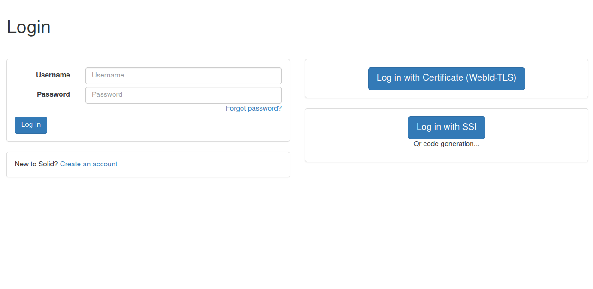

# AJS integration within Solid

Al fine di integrare Hyperledger Aries in Solid è necessario innanzitutto definire 
il ruolo del server: esso sarà un Issuer and Verifier Agent capace sia di rilasciare
credenziali che verificarle.
Il Wallet sarà definito come segue:

```
{
   "label":"solid-agent",
   "walletConfig":{
      "id":"solid-wallet",
      "key":"testkey0000000000000000000000000"
   },
   "indyLedgers":[
      {
         "id":"bcovrin-test-net",
         "isProduction":false,
         "indyNamespace":"bcovrin:test",
         "genesisTransactions":genesisTransactionsBCovrinTestNet
      }
   ],
   "autoAcceptCredentials":AutoAcceptCredential.ContentApproved,
   "autoAcceptConnections":true,
   "endpoints":[
      "http://172.19.148.62:3002"
   ]
}
```

## User Registration
Una volta definito l'Agent del server Solid, è necessario andare a definire uno schema
sulla base del quale verranno rilasciate le credenziali.
Le nostre credenziali conterranno semplicemente il WebID dell'utente, lo schema definito
è il seguente
```
{
   "attributes":[
      "webid"
   ],
   "name":"solid_auth_schema",
   "version":"1.0"
}
```
Tale schema viene registrato sul public ledger e viene assegnato un id univoco
in riferimento allo schema, nel nostro caso sarà
```
LJk1HdDk7uYj6aZb9qWuHF:3:CL:738947:default
```
Tale schema può essere facilmente esteso per includere più attributi.
Nella fase di registrazione alla piattaforma, all'utente verrà rilasciata una credenziale
verificabile che segue questo schema.
```
{
   "protocolVersion":"v1",
   "connectionId": connectionID,
   "credentialFormats":{
      "indy":{
         "credentialDefinitionId":"LJk1HdDk7uYj6aZb9qWuHF:3:CL:738947:default",
         "attributes":[
            {
               "webid":user.WebID
            }
         ]
      }
   }
}
```
L'utente procederà ad accettare la credenziale definita e la conserverà nel suo wallet.

## User Authentication
Al momento dell'accesso l'utente potrà facilmente accedere al proprio wallett 
collegandosi alla pagina di accesso tradizionale



Una volta cliccato su 'Log in with SSI' sarà mostrato il codice QR del collegamento


L'utente potrà scansionare il codice QR con un'applicazione mobile che contiene le credenziali.

## Web Application
La web app è accessibile utilizzando un riconoscimento facciale o un pin ed è associata ad
un wallet.
Le chiavi di accesso al wallet vengono conservate in maniera segreta all'iterno dell'app.


Se le chiavi vengono modificate l'accesso al wallet fallisce e si ottiene un errore


Quando l'utente inserisce il pin corretto ha accesso all'app e può scansoniare QR Code
per le connessioni. Quando scansiona un qr code viene instaurata una connessione.


In fase di emissione di credenziali verranno inviate delle credenziali all'utente, 
quindi il solid server si comporta da issuer. In fase di verifica, il solid server si
comporta da verifier e utilizza l'apposito metodo per verificare le credenziali.


## Limitazioni
Ci sono diverse limitazioni all'approccio esistente. HL Aries è ancora troppo giovane e
non offre stabilità in termini di cambiamenti all'ecosistema, difatti c'è ancora
qualche incompatiblità tra le versioni esistenti per i diversi linguaggi di programmazione.


