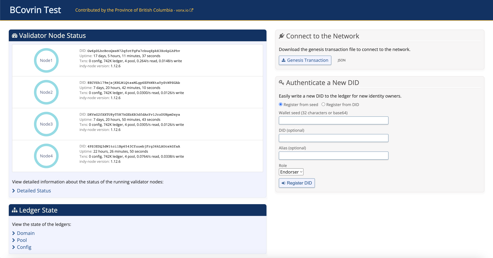
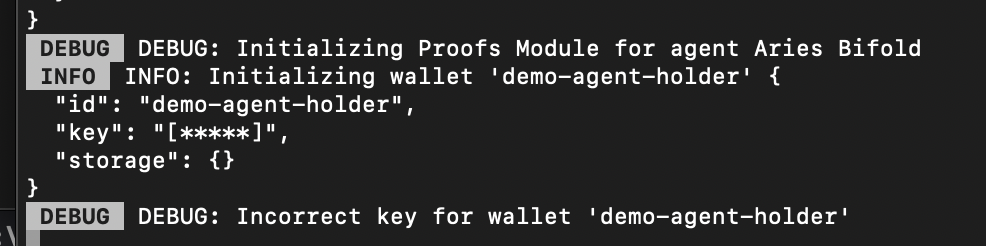

# AJS integration within Solid
Docs on integration of Hyperledger Aries within Solid ecosystem

## Role definition

In order to integrate Hyperledger Aries in Solid it's necessary to define which role will the server plays.

It can be both Issuer and Verifier, able to issue and verify credentials.

```json
{
   "label":"solid-agent",
   "walletConfig":{
      "id":"solid-wallet",
      "key":"testkey0000000000000000000000000"
   },
   "indyLedgers":[
      {
         "id":"bcovrin-test-net",
         "isProduction":false,
         "indyNamespace":"bcovrin:test",
         "genesisTransactions":genesisTransactionsBCovrinTestNet
      }
   ],
   "autoAcceptCredentials":AutoAcceptCredential.ContentApproved,
   "autoAcceptConnections":true,
   "endpoints":[
      "http://172.19.148.62:3002"
   ]
}
```

Note: in Von Network is not possilbe to Issue credentials starting from non registered DID. For this reason it's necessary to register a new DID on the public ledger using the Von Network; in a realistic scenario this access will be restricted to the ecosystem owner



## User Registration

Once defined the agent ruined by solid server, it's necessary to release credentials to the user.
This process happens at registration phase; after user chose preferred username, a QR Code is proposed to create the connection for the exchanging of credentials.
In the next section is discussed the approach used for the connection, in this section we will discuss about the issuing phase, so it's assumed that users has already created a connection with the server.

Aries allows issuing credentials in both Indy or JSON-LD format. 

### JSON-LD Credentials

The JSON-LD is widely known and a demo can be found <a href="https://github.com/hyperledger/aries-cloudagent-python/blob/main/demo/AliceWantsAJsonCredential.md">here</a>. It uses the vucabulary approach to define a schema of attributes on which will release the credentials, no schema definition on ledger is needed, verification is done using JSON-LD verification.
Moreover, security of issuing credentials is based on session key which are released by Indy Wallet itself and will not use the Session DID (as in the case of Indy credentials), which is shown at the end of the current document.

### Indy Credentials

Differently from JSON-LD, in Indy Credentials it's necessary to define a schema, such schema, once defined, is publicly available on the public ledger and everyone can use it to release credentials.

```json
{
   "attributes": [
     "webid"
   ],
   "schema_name": "solid",
   "schema_version": "1.0"
 }
```

```sh
{
    "cred_def_id": "2sMU7txCQcde3fPoWwoL2W:3:CL:20:default",
    "schema_id": "2sMU7txCQcde3fPoWwoL2W:2:solid:1.0"
}
```

Once defined the schema the two ID are available and can be used into the credential definition message. This is the typical message used to release credential by Issuer

```json
"auto_issue": true,
  "comment": "string",
  "connection_id": "2c5c3f39-430d-46d7-98ef-9759ac8cb967",
  "credential_preview": {
      "@type": "issue-credential/1.0/credential-preview",
      "attributes": [
        {
          "name": "webid",
          "value": user.id
        }
      ]
    },
  "filter": {
    "indy": {
      "cred_def_id": "2sMU7txCQcde3fPoWwoL2W:3:CL:20:default",
      "issuer_did": "2sMU7txCQcde3fPoWwoL2W",
      "schema_id": "2sMU7txCQcde3fPoWwoL2W:2:solid:1.0",
      "schema_issuer_did": "2sMU7txCQcde3fPoWwoL2W",
      "schema_name": "solid",
      "schema_version": "1.0"
    }
  }
}
```

Aries Framework internally will do the checks and before to send the credentials to the endpoint associated with the connection_id field will attach the proof. Such proof will be sent to the user jointly with credential. Note that a nonce field is used in order to prevent reply attacks. 

```sh
"cred_offer": {
            "indy": {
                "schema_id": "2sMU7txCQcde3fPoWwoL2W:2:solid:1.0",
                "cred_def_id": "2sMU7txCQcde3fPoWwoL2W:3:CL:24:default",
                "key_correctness_proof": {
                    "c": "84503882629592362595757960889958677283224904746470301060102913710742792064408",
                    "xz_cap": "91665547234443136870988328948108762563996122148533953662287868726661338591938986974259225740521524566193670175815218594180468249567822513390906838861671296786245327452554873253258502872293426381902973956267816993746134382833500272951020388004309351579007936906255636715053270111002620108015982128210714822494252026263402339338925986772166147317486370782317623230599541920867564036977121627006269290771804375960291602600736863829071033562603549150667417638076939560598142328321899727618106673060860559723000011092790508636662349611117341475435543136877431737697708245900885063340876654726615692472515505168800165850203129898120905949430256684693112017124616499203075134715810989328543080595308",
                    "xr_cap": [
                        [
                            "webid",
                            "1674401076112858813199939894883911206737700621732251153847537868141266291435912139494051289955036240006812755217665850390445540306735325424104460772091693119211606354461648747771799814983600747318806797142914526775405095137670925368103278401260697223503174257198525319958601285879969327331612526858518820508505087291731529315493348012902807260303140555131880992628187314486495204760251097060908213979127119257530248379938555839844604477451316839034772923190333458210547341800443707405414161300253695347570211393568711707433785015503988817878324987161838257507754924431033314926103122974050786258081132940198303010782288071816224883059464042643107466257272933799850063195112799805735452072797279"
                        ],
                        [
                            "master_secret",
                            "1326739287883369523111013968271094092638343593645246083887151583037593453535874857374617332953250201091986996402026514209155873185216047778284285145857081643127470030183218802190772745100849867837605608286062184863953862722022088588132274572028420989683290718722799216136404466949662971214953681928773847249507456046997504362197945406664070132367916484891432418138947398015638248595709994082144436984836442509550179532164134056393425774016323000852542283770034533124786130977485165336703984848356119704187149316391345279827241571573949171822338496847073164631018765165761723713529401931911754191524912496083663614244877782375498061404821394822045631537161601694066283449842659319440750812680033"
                        ]
                    ]
                },
                "nonce": "1207589291460843313260089"
            }
        }
    }
```

If Bob accept the credentials then send a message for accepting the proposed credentials to Alice (Issuer), by signing this credential request with his key

```sh
"cred_request": {
            "indy": {
                "prover_did": "QSFeDAkGP5ECNBPUDYkH4z",
                "cred_def_id": "2sMU7txCQcde3fPoWwoL2W:3:CL:24:default",
                "blinded_ms": {
                    "u": "69083427311489001319246597741696310286498054375129546261402145456633052969122415580807481024027956160783174904777129874858307985317727732335373363491997969286441754538929810672631343004330910510640841191304319189646895180508738812731749158221694283608944713460337599911589312876552596924044713714252076605881102929408005371782403808547871210353645315622614172846426191441015459222057343001312742909273266473269391764239424807593154629263385878386585079531476416718274947991905361344503026251778042459032723757931507937958512513920050129272835485819414056306442293289519005115681126705011557604427701288746230353007681",
                    "ur": null,
                    "hidden_attributes": [
                        "master_secret"
                    ],
                    "committed_attributes": {}
                },
                "blinded_ms_correctness_proof": {
                    "c": "104288221102055446604961208218290462533469280803563519283675378066811489434578",
                    "v_dash_cap": "636693025251841326480165680915741455331179065310938910571458077582309505983926800577566332681193976996994165644309629211989308798571635909959011386752438377625438713577204239044773981954662015956272750044020711462289711592600387877496735944013280202462695539597023208325361912302438246354998985318701436770012065183748525236809168383980974570342876915619585801372405829282768202024150595784097025530156795677742189663567796336226171281775190874802719008279703984129430642539455255342185713489000573088664539476170054408518895323704346541382631188682948205198488444010668102606540392207409826862165165576141934205208242540773273381708194417480363328199398169587837281566723491653427643327592122752645347683173932565448",
                    "m_caps": {
                        "master_secret": "12419580760787386928399082284080192635986505312712168733400980256519918437202837073789543784489273606522630690681221734445825572750013899816352045802143879971113174210624162270630"
                    },
                    "r_caps": {}
                },
                "nonce": "848658656471105539394506"
            }
        }
```

This is the entire message, security consideration can be done here.

```sh
{
    "cred_ex_record": {
        "initiator": "external",
        "cred_request": {
            "@type": "did:sov:BzCbsNYhMrjHiqZDTUASHg;spec/issue-credential/2.0/request-credential",
            "@id": "e89b96a1-b9d1-4e41-ab64-a6905d840c41",
            "~thread": {
                "thid": "2f1c5931-9f1d-4263-9af4-95a2f7876e9d"
            },
            "requests~attach": [
                {
                    "@id": "indy",
                    "mime-type": "application/json",
                    "data": {
                        "base64": "eyJwcm92ZXJfZGlkIjogIlFTRmVEQWtHUDVFQ05CUFVEWWtINHoiLCAiY3JlZF9kZWZfaWQiOiAiMnNNVTd0eENRY2RlM2ZQb1d3b0wyVzozOkNMOjI0OmRlZmF1bHQiLCAiYmxpbmRlZF9tcyI6IHsidSI6ICI2OTA4MzQyNzMxMTQ4OTAwMTMxOTI0NjU5Nzc0MTY5NjMxMDI4NjQ5ODA1NDM3NTEyOTU0NjI2MTQwMjE0NTQ1NjYzMzA1Mjk2OTEyMjQxNTU4MDgwNzQ4MTAyNDAyNzk1NjE2MDc4MzE3NDkwNDc3NzEyOTg3NDg1ODMwNzk4NTMxNzcyNzczMjMzNTM3MzM2MzQ5MTk5Nzk2OTI4NjQ0MTc1NDUzODkyOTgxMDY3MjYzMTM0MzAwNDMzMDkxMDUxMDY0MDg0MTE5MTMwNDMxOTE4OTY0Njg5NTE4MDUwODczODgxMjczMTc0OTE1ODIyMTY5NDI4MzYwODk0NDcxMzQ2MDMzNzU5OTkxMTU4OTMxMjg3NjU1MjU5NjkyNDA0NDcxMzcxNDI1MjA3NjYwNTg4MTEwMjkyOTQwODAwNTM3MTc4MjQwMzgwODU0Nzg3MTIxMDM1MzY0NTMxNTYyMjYxNDE3Mjg0NjQyNjE5MTQ0MTAxNTQ1OTIyMjA1NzM0MzAwMTMxMjc0MjkwOTI3MzI2NjQ3MzI2OTM5MTc2NDIzOTQyNDgwNzU5MzE1NDYyOTI2MzM4NTg3ODM4NjU4NTA3OTUzMTQ3NjQxNjcxODI3NDk0Nzk5MTkwNTM2MTM0NDUwMzAyNjI1MTc3ODA0MjQ1OTAzMjcyMzc1NzkzMTUwNzkzNzk1ODUxMjUxMzkyMDA1MDEyOTI3MjgzNTQ4NTgxOTQxNDA1NjMwNjQ0MjI5MzI4OTUxOTAwNTExNTY4MTEyNjcwNTAxMTU1NzYwNDQyNzcwMTI4ODc0NjIzMDM1MzAwNzY4MSIsICJ1ciI6IG51bGwsICJoaWRkZW5fYXR0cmlidXRlcyI6IFsibWFzdGVyX3NlY3JldCJdLCAiY29tbWl0dGVkX2F0dHJpYnV0ZXMiOiB7fX0sICJibGluZGVkX21zX2NvcnJlY3RuZXNzX3Byb29mIjogeyJjIjogIjEwNDI4ODIyMTEwMjA1NTQ0NjYwNDk2MTIwODIxODI5MDQ2MjUzMzQ2OTI4MDgwMzU2MzUxOTI4MzY3NTM3ODA2NjgxMTQ4OTQzNDU3OCIsICJ2X2Rhc2hfY2FwIjogIjYzNjY5MzAyNTI1MTg0MTMyNjQ4MDE2NTY4MDkxNTc0MTQ1NTMzMTE3OTA2NTMxMDkzODkxMDU3MTQ1ODA3NzU4MjMwOTUwNTk4MzkyNjgwMDU3NzU2NjMzMjY4MTE5Mzk3Njk5Njk5NDE2NTY0NDMwOTYyOTIxMTk4OTMwODc5ODU3MTYzNTkwOTk1OTAxMTM4Njc1MjQzODM3NzYyNTQzODcxMzU3NzIwNDIzOTA0NDc3Mzk4MTk1NDY2MjAxNTk1NjI3Mjc1MDA0NDAyMDcxMTQ2MjI4OTcxMTU5MjYwMDM4Nzg3NzQ5NjczNTk0NDAxMzI4MDIwMjQ2MjY5NTUzOTU5NzAyMzIwODMyNTM2MTkxMjMwMjQzODI0NjM1NDk5ODk4NTMxODcwMTQzNjc3MDAxMjA2NTE4Mzc0ODUyNTIzNjgwOTE2ODM4Mzk4MDk3NDU3MDM0Mjg3NjkxNTYxOTU4NTgwMTM3MjQwNTgyOTI4Mjc2ODIwMjAyNDE1MDU5NTc4NDA5NzAyNTUzMDE1Njc5NTY3Nzc0MjE4OTY2MzU2Nzc5NjMzNjIyNjE3MTI4MTc3NTE5MDg3NDgwMjcxOTAwODI3OTcwMzk4NDEyOTQzMDY0MjUzOTQ1NTI1NTM0MjE4NTcxMzQ4OTAwMDU3MzA4ODY2NDUzOTQ3NjE3MDA1NDQwODUxODg5NTMyMzcwNDM0NjU0MTM4MjYzMTE4ODY4Mjk0ODIwNTE5ODQ4ODQ0NDAxMDY2ODEwMjYwNjU0MDM5MjIwNzQwOTgyNjg2MjE2NTE2NTU3NjE0MTkzNDIwNTIwODI0MjU0MDc3MzI3MzM4MTcwODE5NDQxNzQ4MDM2MzMyODE5OTM5ODE2OTU4NzgzNzI4MTU2NjcyMzQ5MTY1MzQyNzY0MzMyNzU5MjEyMjc1MjY0NTM0NzY4MzE3MzkzMjU2NTQ0OCIsICJtX2NhcHMiOiB7Im1hc3Rlcl9zZWNyZXQiOiAiMTI0MTk1ODA3NjA3ODczODY5MjgzOTkwODIyODQwODAxOTI2MzU5ODY1MDUzMTI3MTIxNjg3MzM0MDA5ODAyNTY1MTk5MTg0MzcyMDI4MzcwNzM3ODk1NDM3ODQ0ODkyNzM2MDY1MjI2MzA2OTA2ODEyMjE3MzQ0NDU4MjU1NzI3NTAwMTM4OTk4MTYzNTIwNDU4MDIxNDM4Nzk5NzExMTMxNzQyMTA2MjQxNjIyNzA2MzAifSwgInJfY2FwcyI6IHt9fSwgIm5vbmNlIjogIjg0ODY1ODY1NjQ3MTEwNTUzOTM5NDUwNiJ9"
                    }
                }
            ],
            "formats": [
                {
                    "attach_id": "indy",
                    "format": "hlindy/cred-req@v2.0"
                }
            ]
        },
        "by_format": {
            "cred_issue": {
                "indy": {
                    "schema_id": "2sMU7txCQcde3fPoWwoL2W:2:solid:1.0",
                    "cred_def_id": "2sMU7txCQcde3fPoWwoL2W:3:CL:24:default",
                    "rev_reg_id": null,
                    "values": {
                        "webid": {
                            "raw": "martini",
                            "encoded": "87220867687149741819942399580253240992977336357180185046122537689481009491954"
                        }
                    },
                    "signature": {
                        "p_credential": {
                            "m_2": "32646929991037942738257343821214622776578264684247500906340245082622474179280",
                            "a": "84431553663707200498033638597774811431924164285125282621668366969623259756842800258321775445025932578852741782290652215964934152586315809910134861935917739569299674997855391617832646053511513418535827439185785804008349076594249644991182515685529435093746266380120901652671595986437664305044947992070688064809153101782070394671439930067792933099651005180898525280312406268346929984778105566284751042907097119107704763784885850576932871832884596919424452052190486790207645564775578706899768320069848006600330730554769454059159754160622334311018910951349385394828319118222984470904382730960331208310304896340422212120052",
                            "e": "259344723055062059907025491480697571938277889515152306249728583105665800713306759149981690559193987143012367913206299323899696942213235956742929751485100453050994437121458459333479",
                            "v": "9091301950087445529757189875497661853157630603452753534507623932703185781576229972337910004476034607489080178115746621309823752896258425075773793163986102504921036692230791891743993467050925093822300744495941490152336679282048685709406833476656174741738175102281049384654387943573070512837040186125125542005128649808194887323292287275966410171945851842350199872109143889525154887322279821935658167815348570844588787863862813661020538017237172039620631934458780175817086183494762594794536372305685413302215976558970227792769398913820804367323971894540486597089246310399096738368959458987406482888889252979836074785946698673873225809076984629795087015649271297400180095834322556268309380224460401885730206891308899215607768660889199984318957967967988502304468211649214580204667817986359286881630639367073945981298917854058"
                        },
                        "r_credential": null
                    },
                    "signature_correctness_proof": {
                        "se": "16175342432098136019827230492908752222637554541635750518823605636938228731397453700289709343287696124332375941095810726181081666556408382644799033735209281687519813890519656344943408453521468609594110743520433649541701484978052388377764507201254327019086974264609504823854367890150881205581846058792620841772766491516466136384493726526801633735853899719849894619109422817296372136165592547315554174158846902537765369285507012541009685128659912052832426237012123484601811880859634661116176160787579903675002135693239484324346613331097807575841702899534152049342912354989341006827815333495271061229156258270440902954119",
                        "c": "84278970981146267946490056789150599263502549443360350408235572910611669358354"
                    },
                    "rev_reg": null,
                    "witness": null
                }
            },
            "cred_offer": {
                "indy": {
                    "schema_id": "2sMU7txCQcde3fPoWwoL2W:2:solid:1.0",
                    "cred_def_id": "2sMU7txCQcde3fPoWwoL2W:3:CL:24:default",
                    "key_correctness_proof": {
                        "c": "84503882629592362595757960889958677283224904746470301060102913710742792064408",
                        "xz_cap": "91665547234443136870988328948108762563996122148533953662287868726661338591938986974259225740521524566193670175815218594180468249567822513390906838861671296786245327452554873253258502872293426381902973956267816993746134382833500272951020388004309351579007936906255636715053270111002620108015982128210714822494252026263402339338925986772166147317486370782317623230599541920867564036977121627006269290771804375960291602600736863829071033562603549150667417638076939560598142328321899727618106673060860559723000011092790508636662349611117341475435543136877431737697708245900885063340876654726615692472515505168800165850203129898120905949430256684693112017124616499203075134715810989328543080595308",
                        "xr_cap": [
                            [
                                "webid",
                                "1674401076112858813199939894883911206737700621732251153847537868141266291435912139494051289955036240006812755217665850390445540306735325424104460772091693119211606354461648747771799814983600747318806797142914526775405095137670925368103278401260697223503174257198525319958601285879969327331612526858518820508505087291731529315493348012902807260303140555131880992628187314486495204760251097060908213979127119257530248379938555839844604477451316839034772923190333458210547341800443707405414161300253695347570211393568711707433785015503988817878324987161838257507754924431033314926103122974050786258081132940198303010782288071816224883059464042643107466257272933799850063195112799805735452072797279"
                            ],
                            [
                                "master_secret",
                                "1326739287883369523111013968271094092638343593645246083887151583037593453535874857374617332953250201091986996402026514209155873185216047778284285145857081643127470030183218802190772745100849867837605608286062184863953862722022088588132274572028420989683290718722799216136404466949662971214953681928773847249507456046997504362197945406664070132367916484891432418138947398015638248595709994082144436984836442509550179532164134056393425774016323000852542283770034533124786130977485165336703984848356119704187149316391345279827241571573949171822338496847073164631018765165761723713529401931911754191524912496083663614244877782375498061404821394822045631537161601694066283449842659319440750812680033"
                            ]
                        ]
                    },
                    "nonce": "1207589291460843313260089"
                }
            },
            "cred_request": {
                "indy": {
                    "prover_did": "QSFeDAkGP5ECNBPUDYkH4z",
                    "cred_def_id": "2sMU7txCQcde3fPoWwoL2W:3:CL:24:default",
                    "blinded_ms": {
                        "u": "69083427311489001319246597741696310286498054375129546261402145456633052969122415580807481024027956160783174904777129874858307985317727732335373363491997969286441754538929810672631343004330910510640841191304319189646895180508738812731749158221694283608944713460337599911589312876552596924044713714252076605881102929408005371782403808547871210353645315622614172846426191441015459222057343001312742909273266473269391764239424807593154629263385878386585079531476416718274947991905361344503026251778042459032723757931507937958512513920050129272835485819414056306442293289519005115681126705011557604427701288746230353007681",
                        "ur": null,
                        "hidden_attributes": [
                            "master_secret"
                        ],
                        "committed_attributes": {}
                    },
                    "blinded_ms_correctness_proof": {
                        "c": "104288221102055446604961208218290462533469280803563519283675378066811489434578",
                        "v_dash_cap": "636693025251841326480165680915741455331179065310938910571458077582309505983926800577566332681193976996994165644309629211989308798571635909959011386752438377625438713577204239044773981954662015956272750044020711462289711592600387877496735944013280202462695539597023208325361912302438246354998985318701436770012065183748525236809168383980974570342876915619585801372405829282768202024150595784097025530156795677742189663567796336226171281775190874802719008279703984129430642539455255342185713489000573088664539476170054408518895323704346541382631188682948205198488444010668102606540392207409826862165165576141934205208242540773273381708194417480363328199398169587837281566723491653427643327592122752645347683173932565448",
                        "m_caps": {
                            "master_secret": "12419580760787386928399082284080192635986505312712168733400980256519918437202837073789543784489273606522630690681221734445825572750013899816352045802143879971113174210624162270630"
                        },
                        "r_caps": {}
                    },
                    "nonce": "848658656471105539394506"
                }
            }
        },
        "state": "done",
        "auto_offer": false,
        "auto_issue": false,
        "updated_at": "2023-03-30T17:39:50.589341Z",
        "cred_ex_id": "c36bda2a-cc13-42ab-9452-2361371b776f",
        "thread_id": "2f1c5931-9f1d-4263-9af4-95a2f7876e9d",
        "created_at": "2023-03-30T17:31:53.476036Z",
        "trace": false,
        "role": "holder",
        "auto_remove": true,
        "cred_issue": {
            "@type": "did:sov:BzCbsNYhMrjHiqZDTUASHg;spec/issue-credential/2.0/issue-credential",
            "@id": "4a7c4275-af19-4394-9889-172e13891385",
            "~thread": {
                "thid": "2f1c5931-9f1d-4263-9af4-95a2f7876e9d"
            },
            "formats": [
                {
                    "attach_id": "indy",
                    "format": "hlindy/cred@v2.0"
                }
            ],
            "credentials~attach": [
                {
                    "@id": "indy",
                    "mime-type": "application/json",
                    "data": {
                        "base64": "eyJzY2hlbWFfaWQiOiAiMnNNVTd0eENRY2RlM2ZQb1d3b0wyVzoyOnNvbGlkOjEuMCIsICJjcmVkX2RlZl9pZCI6ICIyc01VN3R4Q1FjZGUzZlBvV3dvTDJXOjM6Q0w6MjQ6ZGVmYXVsdCIsICJyZXZfcmVnX2lkIjogbnVsbCwgInZhbHVlcyI6IHsid2ViaWQiOiB7InJhdyI6ICJtYXJ0aW5pIiwgImVuY29kZWQiOiAiODcyMjA4Njc2ODcxNDk3NDE4MTk5NDIzOTk1ODAyNTMyNDA5OTI5NzczMzYzNTcxODAxODUwNDYxMjI1Mzc2ODk0ODEwMDk0OTE5NTQifX0sICJzaWduYXR1cmUiOiB7InBfY3JlZGVudGlhbCI6IHsibV8yIjogIjMyNjQ2OTI5OTkxMDM3OTQyNzM4MjU3MzQzODIxMjE0NjIyNzc2NTc4MjY0Njg0MjQ3NTAwOTA2MzQwMjQ1MDgyNjIyNDc0MTc5MjgwIiwgImEiOiAiODQ0MzE1NTM2NjM3MDcyMDA0OTgwMzM2Mzg1OTc3NzQ4MTE0MzE5MjQxNjQyODUxMjUyODI2MjE2NjgzNjY5Njk2MjMyNTk3NTY4NDI4MDAyNTgzMjE3NzU0NDUwMjU5MzI1Nzg4NTI3NDE3ODIyOTA2NTIyMTU5NjQ5MzQxNTI1ODYzMTU4MDk5MTAxMzQ4NjE5MzU5MTc3Mzk1NjkyOTk2NzQ5OTc4NTUzOTE2MTc4MzI2NDYwNTM1MTE1MTM0MTg1MzU4Mjc0MzkxODU3ODU4MDQwMDgzNDkwNzY1OTQyNDk2NDQ5OTExODI1MTU2ODU1Mjk0MzUwOTM3NDYyNjYzODAxMjA5MDE2NTI2NzE1OTU5ODY0Mzc2NjQzMDUwNDQ5NDc5OTIwNzA2ODgwNjQ4MDkxNTMxMDE3ODIwNzAzOTQ2NzE0Mzk5MzAwNjc3OTI5MzMwOTk2NTEwMDUxODA4OTg1MjUyODAzMTI0MDYyNjgzNDY5Mjk5ODQ3NzgxMDU1NjYyODQ3NTEwNDI5MDcwOTcxMTkxMDc3MDQ3NjM3ODQ4ODU4NTA1NzY5MzI4NzE4MzI4ODQ1OTY5MTk0MjQ0NTIwNTIxOTA0ODY3OTAyMDc2NDU1NjQ3NzU1Nzg3MDY4OTk3NjgzMjAwNjk4NDgwMDY2MDAzMzA3MzA1NTQ3Njk0NTQwNTkxNTk3NTQxNjA2MjIzMzQzMTEwMTg5MTA5NTEzNDkzODUzOTQ4MjgzMTkxMTgyMjI5ODQ0NzA5MDQzODI3MzA5NjAzMzEyMDgzMTAzMDQ4OTYzNDA0MjIyMTIxMjAwNTIiLCAiZSI6ICIyNTkzNDQ3MjMwNTUwNjIwNTk5MDcwMjU0OTE0ODA2OTc1NzE5MzgyNzc4ODk1MTUxNTIzMDYyNDk3Mjg1ODMxMDU2NjU4MDA3MTMzMDY3NTkxNDk5ODE2OTA1NTkxOTM5ODcxNDMwMTIzNjc5MTMyMDYyOTkzMjM4OTk2OTY5NDIyMTMyMzU5NTY3NDI5Mjk3NTE0ODUxMDA0NTMwNTA5OTQ0MzcxMjE0NTg0NTkzMzM0NzkiLCAidiI6ICI5MDkxMzAxOTUwMDg3NDQ1NTI5NzU3MTg5ODc1NDk3NjYxODUzMTU3NjMwNjAzNDUyNzUzNTM0NTA3NjIzOTMyNzAzMTg1NzgxNTc2MjI5OTcyMzM3OTEwMDA0NDc2MDM0NjA3NDg5MDgwMTc4MTE1NzQ2NjIxMzA5ODIzNzUyODk2MjU4NDI1MDc1NzczNzkzMTYzOTg2MTAyNTA0OTIxMDM2NjkyMjMwNzkxODkxNzQzOTkzNDY3MDUwOTI1MDkzODIyMzAwNzQ0NDk1OTQxNDkwMTUyMzM2Njc5MjgyMDQ4Njg1NzA5NDA2ODMzNDc2NjU2MTc0NzQxNzM4MTc1MTAyMjgxMDQ5Mzg0NjU0Mzg3OTQzNTczMDcwNTEyODM3MDQwMTg2MTI1MTI1NTQyMDA1MTI4NjQ5ODA4MTk0ODg3MzIzMjkyMjg3Mjc1OTY2NDEwMTcxOTQ1ODUxODQyMzUwMTk5ODcyMTA5MTQzODg5NTI1MTU0ODg3MzIyMjc5ODIxOTM1NjU4MTY3ODE1MzQ4NTcwODQ0NTg4Nzg3ODYzODYyODEzNjYxMDIwNTM4MDE3MjM3MTcyMDM5NjIwNjMxOTM0NDU4NzgwMTc1ODE3MDg2MTgzNDk0NzYyNTk0Nzk0NTM2MzcyMzA1Njg1NDEzMzAyMjE1OTc2NTU4OTcwMjI3NzkyNzY5Mzk4OTEzODIwODA0MzY3MzIzOTcxODk0NTQwNDg2NTk3MDg5MjQ2MzEwMzk5MDk2NzM4MzY4OTU5NDU4OTg3NDA2NDgyODg4ODg5MjUyOTc5ODM2MDc0Nzg1OTQ2Njk4NjczODczMjI1ODA5MDc2OTg0NjI5Nzk1MDg3MDE1NjQ5MjcxMjk3NDAwMTgwMDk1ODM0MzIyNTU2MjY4MzA5MzgwMjI0NDYwNDAxODg1NzMwMjA2ODkxMzA4ODk5MjE1NjA3NzY4NjYwODg5MTk5OTg0MzE4OTU3OTY3OTY3OTg4NTAyMzA0NDY4MjExNjQ5MjE0NTgwMjA0NjY3ODE3OTg2MzU5Mjg2ODgxNjMwNjM5MzY3MDczOTQ1OTgxMjk4OTE3ODU0MDU4In0sICJyX2NyZWRlbnRpYWwiOiBudWxsfSwgInNpZ25hdHVyZV9jb3JyZWN0bmVzc19wcm9vZiI6IHsic2UiOiAiMTYxNzUzNDI0MzIwOTgxMzYwMTk4MjcyMzA0OTI5MDg3NTIyMjI2Mzc1NTQ1NDE2MzU3NTA1MTg4MjM2MDU2MzY5MzgyMjg3MzEzOTc0NTM3MDAyODk3MDkzNDMyODc2OTYxMjQzMzIzNzU5NDEwOTU4MTA3MjYxODEwODE2NjY1NTY0MDgzODI2NDQ3OTkwMzM3MzUyMDkyODE2ODc1MTk4MTM4OTA1MTk2NTYzNDQ5NDM0MDg0NTM1MjE0Njg2MDk1OTQxMTA3NDM1MjA0MzM2NDk1NDE3MDE0ODQ5NzgwNTIzODgzNzc3NjQ1MDcyMDEyNTQzMjcwMTkwODY5NzQyNjQ2MDk1MDQ4MjM4NTQzNjc4OTAxNTA4ODEyMDU1ODE4NDYwNTg3OTI2MjA4NDE3NzI3NjY0OTE1MTY0NjYxMzYzODQ0OTM3MjY1MjY4MDE2MzM3MzU4NTM4OTk3MTk4NDk4OTQ2MTkxMDk0MjI4MTcyOTYzNzIxMzYxNjU1OTI1NDczMTU1NTQxNzQxNTg4NDY5MDI1Mzc3NjUzNjkyODU1MDcwMTI1NDEwMDk2ODUxMjg2NTk5MTIwNTI4MzI0MjYyMzcwMTIxMjM0ODQ2MDE4MTE4ODA4NTk2MzQ2NjExMTYxNzYxNjA3ODc1Nzk5MDM2NzUwMDIxMzU2OTMyMzk0ODQzMjQzNDY2MTMzMzEwOTc4MDc1NzU4NDE3MDI4OTk1MzQxNTIwNDkzNDI5MTIzNTQ5ODkzNDEwMDY4Mjc4MTUzMzM0OTUyNzEwNjEyMjkxNTYyNTgyNzA0NDA5MDI5NTQxMTkiLCAiYyI6ICI4NDI3ODk3MDk4MTE0NjI2Nzk0NjQ5MDA1Njc4OTE1MDU5OTI2MzUwMjU0OTQ0MzM2MDM1MDQwODIzNTU3MjkxMDYxMTY2OTM1ODM1NCJ9LCAicmV2X3JlZyI6IG51bGwsICJ3aXRuZXNzIjogbnVsbH0="
                    }
                }
            ]
        },
        "cred_offer": {
            "@type": "did:sov:BzCbsNYhMrjHiqZDTUASHg;spec/issue-credential/2.0/offer-credential",
            "@id": "2f1c5931-9f1d-4263-9af4-95a2f7876e9d",
            "~thread": {},
            "comment": "create automated v2.0 credential exchange record",
            "formats": [
                {
                    "attach_id": "indy",
                    "format": "hlindy/cred-abstract@v2.0"
                }
            ],
            "offers~attach": [
                {
                    "@id": "indy",
                    "mime-type": "application/json",
                    "data": {
                        "base64": "eyJzY2hlbWFfaWQiOiAiMnNNVTd0eENRY2RlM2ZQb1d3b0wyVzoyOnNvbGlkOjEuMCIsICJjcmVkX2RlZl9pZCI6ICIyc01VN3R4Q1FjZGUzZlBvV3dvTDJXOjM6Q0w6MjQ6ZGVmYXVsdCIsICJrZXlfY29ycmVjdG5lc3NfcHJvb2YiOiB7ImMiOiAiODQ1MDM4ODI2Mjk1OTIzNjI1OTU3NTc5NjA4ODk5NTg2NzcyODMyMjQ5MDQ3NDY0NzAzMDEwNjAxMDI5MTM3MTA3NDI3OTIwNjQ0MDgiLCAieHpfY2FwIjogIjkxNjY1NTQ3MjM0NDQzMTM2ODcwOTg4MzI4OTQ4MTA4NzYyNTYzOTk2MTIyMTQ4NTMzOTUzNjYyMjg3ODY4NzI2NjYxMzM4NTkxOTM4OTg2OTc0MjU5MjI1NzQwNTIxNTI0NTY2MTkzNjcwMTc1ODE1MjE4NTk0MTgwNDY4MjQ5NTY3ODIyNTEzMzkwOTA2ODM4ODYxNjcxMjk2Nzg2MjQ1MzI3NDUyNTU0ODczMjUzMjU4NTAyODcyMjkzNDI2MzgxOTAyOTczOTU2MjY3ODE2OTkzNzQ2MTM0MzgyODMzNTAwMjcyOTUxMDIwMzg4MDA0MzA5MzUxNTc5MDA3OTM2OTA2MjU1NjM2NzE1MDUzMjcwMTExMDAyNjIwMTA4MDE1OTgyMTI4MjEwNzE0ODIyNDk0MjUyMDI2MjYzNDAyMzM5MzM4OTI1OTg2NzcyMTY2MTQ3MzE3NDg2MzcwNzgyMzE3NjIzMjMwNTk5NTQxOTIwODY3NTY0MDM2OTc3MTIxNjI3MDA2MjY5MjkwNzcxODA0Mzc1OTYwMjkxNjAyNjAwNzM2ODYzODI5MDcxMDMzNTYyNjAzNTQ5MTUwNjY3NDE3NjM4MDc2OTM5NTYwNTk4MTQyMzI4MzIxODk5NzI3NjE4MTA2NjczMDYwODYwNTU5NzIzMDAwMDExMDkyNzkwNTA4NjM2NjYyMzQ5NjExMTE3MzQxNDc1NDM1NTQzMTM2ODc3NDMxNzM3Njk3NzA4MjQ1OTAwODg1MDYzMzQwODc2NjU0NzI2NjE1NjkyNDcyNTE1NTA1MTY4ODAwMTY1ODUwMjAzMTI5ODk4MTIwOTA1OTQ5NDMwMjU2Njg0NjkzMTEyMDE3MTI0NjE2NDk5MjAzMDc1MTM0NzE1ODEwOTg5MzI4NTQzMDgwNTk1MzA4IiwgInhyX2NhcCI6IFtbIndlYmlkIiwgIjE2NzQ0MDEwNzYxMTI4NTg4MTMxOTk5Mzk4OTQ4ODM5MTEyMDY3Mzc3MDA2MjE3MzIyNTExNTM4NDc1Mzc4NjgxNDEyNjYyOTE0MzU5MTIxMzk0OTQwNTEyODk5NTUwMzYyNDAwMDY4MTI3NTUyMTc2NjU4NTAzOTA0NDU1NDAzMDY3MzUzMjU0MjQxMDQ0NjA3NzIwOTE2OTMxMTkyMTE2MDYzNTQ0NjE2NDg3NDc3NzE3OTk4MTQ5ODM2MDA3NDczMTg4MDY3OTcxNDI5MTQ1MjY3NzU0MDUwOTUxMzc2NzA5MjUzNjgxMDMyNzg0MDEyNjA2OTcyMjM1MDMxNzQyNTcxOTg1MjUzMTk5NTg2MDEyODU4Nzk5NjkzMjczMzE2MTI1MjY4NTg1MTg4MjA1MDg1MDUwODcyOTE3MzE1MjkzMTU0OTMzNDgwMTI5MDI4MDcyNjAzMDMxNDA1NTUxMzE4ODA5OTI2MjgxODczMTQ0ODY0OTUyMDQ3NjAyNTEwOTcwNjA5MDgyMTM5NzkxMjcxMTkyNTc1MzAyNDgzNzk5Mzg1NTU4Mzk4NDQ2MDQ0Nzc0NTEzMTY4MzkwMzQ3NzI5MjMxOTAzMzM0NTgyMTA1NDczNDE4MDA0NDM3MDc0MDU0MTQxNjEzMDAyNTM2OTUzNDc1NzAyMTEzOTM1Njg3MTE3MDc0MzM3ODUwMTU1MDM5ODg4MTc4NzgzMjQ5ODcxNjE4MzgyNTc1MDc3NTQ5MjQ0MzEwMzMzMTQ5MjYxMDMxMjI5NzQwNTA3ODYyNTgwODExMzI5NDAxOTgzMDMwMTA3ODIyODgwNzE4MTYyMjQ4ODMwNTk0NjQwNDI2NDMxMDc0NjYyNTcyNzI5MzM3OTk4NTAwNjMxOTUxMTI3OTk4MDU3MzU0NTIwNzI3OTcyNzkiXSwgWyJtYXN0ZXJfc2VjcmV0IiwgIjEzMjY3MzkyODc4ODMzNjk1MjMxMTEwMTM5NjgyNzEwOTQwOTI2MzgzNDM1OTM2NDUyNDYwODM4ODcxNTE1ODMwMzc1OTM0NTM1MzU4NzQ4NTczNzQ2MTczMzI5NTMyNTAyMDEwOTE5ODY5OTY0MDIwMjY1MTQyMDkxNTU4NzMxODUyMTYwNDc3NzgyODQyODUxNDU4NTcwODE2NDMxMjc0NzAwMzAxODMyMTg4MDIxOTA3NzI3NDUxMDA4NDk4Njc4Mzc2MDU2MDgyODYwNjIxODQ4NjM5NTM4NjI3MjIwMjIwODg1ODgxMzIyNzQ1NzIwMjg0MjA5ODk2ODMyOTA3MTg3MjI3OTkyMTYxMzY0MDQ0NjY5NDk2NjI5NzEyMTQ5NTM2ODE5Mjg3NzM4NDcyNDk1MDc0NTYwNDY5OTc1MDQzNjIxOTc5NDU0MDY2NjQwNzAxMzIzNjc5MTY0ODQ4OTE0MzI0MTgxMzg5NDczOTgwMTU2MzgyNDg1OTU3MDk5OTQwODIxNDQ0MzY5ODQ4MzY0NDI1MDk1NTAxNzk1MzIxNjQxMzQwNTYzOTM0MjU3NzQwMTYzMjMwMDA4NTI1NDIyODM3NzAwMzQ1MzMxMjQ3ODYxMzA5Nzc0ODUxNjUzMzY3MDM5ODQ4NDgzNTYxMTk3MDQxODcxNDkzMTYzOTEzNDUyNzk4MjcyNDE1NzE1NzM5NDkxNzE4MjIzMzg0OTY4NDcwNzMxNjQ2MzEwMTg3NjUxNjU3NjE3MjM3MTM1Mjk0MDE5MzE5MTE3NTQxOTE1MjQ5MTI0OTYwODM2NjM2MTQyNDQ4Nzc3ODIzNzU0OTgwNjE0MDQ4MjEzOTQ4MjIwNDU2MzE1MzcxNjE2MDE2OTQwNjYyODM0NDk4NDI2NTkzMTk0NDA3NTA4MTI2ODAwMzMiXV19LCAibm9uY2UiOiAiMTIwNzU4OTI5MTQ2MDg0MzMxMzI2MDA4OSJ9"
                    }
                }
            ],
            "credential_preview": {
                "@type": "did:sov:BzCbsNYhMrjHiqZDTUASHg;spec/issue-credential/2.0/credential-preview",
                "attributes": [
                    {
                        "name": "webid",
                        "mime-type": "image/jpeg",
                        "value": "martini"
                    }
                ]
            }
        },
        "connection_id": "5b355de5-c196-4397-81e1-7f441821d7d7"
    },
    "indy": {
        "cred_request_metadata": {
            "master_secret_blinding_data": {
                "v_prime": "6105128829734085474339709115045991844889367583603801755344903883260630012166780632542789006943216718940454514895167578194429469154794061788223161870939970698568436290559621097094865642989539525475613941117308341307862874336997440511756483807693475859760542770003270525287947153333884073874794512172576963657538539408333418650903959346852090908327254785186420503166906192775805744542681616731462467252983510314007567001951877870631412920632426817414225453108004185452074395871524754088160946839883207999937112907330651689466082083953728388097737635462286206495357999976253870228658477593245824346407093682461341778183135012553582467874977262",
                "vr_prime": null
            },
            "nonce": "848658656471105539394506",
            "master_secret_name": "Bob1"
        },
        "cred_id_stored": "da60ad4c-0c46-423d-9cf4-75e969594c7b",
        "cred_ex_indy_id": "ddf11dcf-0bc0-4a4a-bcd9-3735da104c05",
        "updated_at": "2023-03-30T17:39:50.570578Z",
        "cred_ex_id": "c36bda2a-cc13-42ab-9452-2361371b776f",
        "created_at": "2023-03-30T17:35:36.445864Z"
    },
    "ld_proof": null
}
```

Finally, the user can check the credentials stored in its wallet

```sh
{
    "results": [
        {
            "referent": "da60ad4c-0c46-423d-9cf4-75e969594c7b",
            "attrs": {
                "webid": "martini"
            },
            "schema_id": "2sMU7txCQcde3fPoWwoL2W:2:solid:1.0",
            "cred_def_id": "2sMU7txCQcde3fPoWwoL2W:3:CL:24:default",
            "rev_reg_id": null,
            "cred_rev_id": null
        }
    ]
}
```

## User Authentication

Once the registration phase is ended with success, the user can use his Indy Credentials for the access. A QR Code is available and can be scanned by app associated with the wallet used for credentials definition. Such QR Code creates a secure connection between server and client by exchanging the DIDs needed for signing presentation messages.


## Web Application

As widely said, the user need an application (or an agent) to scan the qr code proposed, such application can be unlocked using biometric data or PIN and stores all credentials within an Indy wallet. If keys are compromised an error will break the execution.



When user insert right pin, the access will be granted and can scan the qr code and initializate the communication


## DID Exchange

In what follows, an investigation about the key used for signing the credentials is presented.

When a connection has been established (state: completed), both agents will know the session DID of each other. Here are the two connection json representation of Alice and Bob. As is possible to see, they share the session did. Note that each time a new connection will be establisher, a new did will be released in order to increase security.

```sh
{
            "my_did": "QSFeDAkGP5ECNBPUDYkH4z", # Bob's session DID (User)
            "rfc23_state": "completed",
            "their_label": "Alice",
            "connection_protocol": "didexchange/1.0",
            "state": "active",
            "accept": "manual",
            "their_role": "inviter",
            "updated_at": "2023-03-30T16:57:06.198061Z",
            "invitation_mode": "once",
            "invitation_msg_id": "99ab9b0c-61fb-421f-879b-9e56a8fb4147",
            "request_id": "b38c6408-cbe9-447a-aec3-5fbaa5f4ecfb",
            "routing_state": "none",
            "created_at": "2023-03-30T16:56:27.653040Z",
            "their_did": "7wmmgyrXPiyqvNKMxv5Sg7", # Alice's session DID (solid Server)
            "invitation_key": "HVD3XrcUASG4GmuwKh96jjSkzYa731yM2Wr4HMjpqusk",
            "connection_id": "5b355de5-c196-4397-81e1-7f441821d7d7"
}
```

```sh
{
            "my_did": "7wmmgyrXPiyqvNKMxv5Sg7", # ALice's session DID (solid Server)
            "state": "active",
            "accept": "manual",
            "invitation_msg_id": "99ab9b0c-61fb-421f-879b-9e56a8fb4147",
            "updated_at": "2023-03-30T16:57:06.261327Z",
            "rfc23_state": "completed",
            "created_at": "2023-03-30T16:56:11.649866Z",
            "their_did": "QSFeDAkGP5ECNBPUDYkH4z", # Bob's session DID (Solid Server)
            "their_label": "Bob",
            "invitation_key": "HVD3XrcUASG4GmuwKh96jjSkzYa731yM2Wr4HMjpqusk",
            "request_id": "b38c6408-cbe9-447a-aec3-5fbaa5f4ecfb",
            "routing_state": "none",
            "connection_id": "6d6be63a-f734-4f93-9f04-ddfa411ac3dc",
            "connection_protocol": "didexchange/1.0",
            "invitation_mode": "once",
            "their_role": "invitee"
}
```

## Server Verification

As said, the server can verify the credentials send by client (users) before grant access.

Both in JSON-LD credentials and Indy Credentials a presentation request must be done.
In the case of JSON-LD credentials the verification of response is done using JSON-LD protocol. In Indy Credentials instead, a call to the blockchain is necessary to verify the truth.

The presentation request can be predecative in case of ZKP, or require the entire propierty, such in our case

```json
{
  "auto_verify": true,
  "comment": "string",
  "connection_id": "2c5c3f39-430d-46d7-98ef-9759ac8cb967",
  "presentation_request": {
    "indy": {
      "name": "Proof request",
      "non_revoked": {
        "from": 1640995199,
        "to": 1640995199
      },
      "nonce": "1",
      "requested_attributes": {
        "additionalProp1": {
          "name": "webid",
          "non_revoked": {
            "from": 1640995199,
            "to": 1640995199
          },
          "restrictions": [
            {
            }
          ]
        }
      },
      "requested_predicates": {
      },
      "version": "1.0"
    }
  },
  "trace": false
}
```

Then, user will check the requested attributes, once established that is ok, can answer with a presentation, which contains the value of the proof.

```json
"indy": {
                "proof": {
                    "proofs": [
                        {
                            "primary_proof": {
                                "eq_proof": {
                                    "revealed_attrs": {},
                                    "a_prime": "6617956130816097529977003013297340073831203129591005493142910020191754288578328001177285344409515105260785432386257485392920618442728922787076325843304732473184593188551687610189908231201398268855076610126745121232349566781239124401550590464107306305838429928641474048078000868127296393663026380019327309919417649630626359840047677716163674624984050304659226893973568267828320010926456731623057451640266243933131887866590162467903061727453806705170481331634198590186047672525293866500118502573754494981687055157420622252835945568061709015991160898927515514812497742423207286843024744365970791670164426911654616464157",
                                    "e": "30234257955898599471664431058550910339053745466167005712152081782232460277550906381292168747398987266159431513545955276944354076471469024",
                                    "v": "49767860594446175917250094073603771960700952896041917528184830303441427819992921656785667552180246210301677064999172792496984773159274120232170798857799692886231200072503411357319641275221332931828781150190753270059127644510685624695270758600199645884754583305873523201980676898608583191682249694503371741886809826764109488844341893198869318815137343929618573511078335596136354495872629725433660832102915578075917870462205779269935259415319641268390762333465279032754555197207375531110881650396724875651232812402249072438234200104763480224833270045356516138617944648698863517955705232044235415994317270725489747768059897405325486822634846656860719377596978268564759342583264604930611617151848238631558709182984678224945894416837401861251193363054549213141764661006718013532517602975424170232621851570634673320879055158273514144141602913217807910159353494923033604151364888765051458510638633048122317276272124588283087666",
                                    "m": {
                                        "webid": "10661184565699898150867470066382971009713369615326095013072736743613946143993860064490875005470597188604637001806351424234570183077089517672424642682825407741132934255974760189552",
                                        "master_secret": "14264857867915725049783463585716708684174996611171648036493249558189670538486848236441049944532305110223426400429053177007612155103280852021745699386431167208482154541181163534108"
                                    },
                                    "m2": "6755983302053761543301215637062445610562439402472298318529403534683548242158436451798493999368773340172302562391062712582260986998949753610684056766589578316974623258247356642795"
                                },
                                "ge_proofs": []
                            },
                            "non_revoc_proof": null
                        }
                    ],
                    "aggregated_proof": {
                        "c_hash": "101383845659958909031749808473723906754089991159381441740561118757247314426113",
                        "c_list": [
                            [
                                52,
                                108,
                                ...

                                ...
                                ...
                                
                            ]
                        ]
                    }
                },
```

At this point Hyperledger Aries will ask to the public ledger if the proof is valid and if it is correctly referred to the value passed as verifiable credentials and give to the user access to the server by extracting the user.id from the presentation send from the user

## Conclusions

Such approach aims at decentralize the way in which Solid authenticate users. The proposed schema shown validity of such approach also in terms of security, considering signature on issuing. An approach based on json-ld may eliminate blockchain in favor of vucabulary but consideration about ZKP must be done in order to assess if JSON-LD can do the same of Indy in terms of predicative proof. Deployed application is developed in React Native but needs a mediator to work, some existing solution uses Aca-Py which could be a valid mediator. The involving of a thirdy part may increase the level of complexity in terms of security evaluation to be done.
